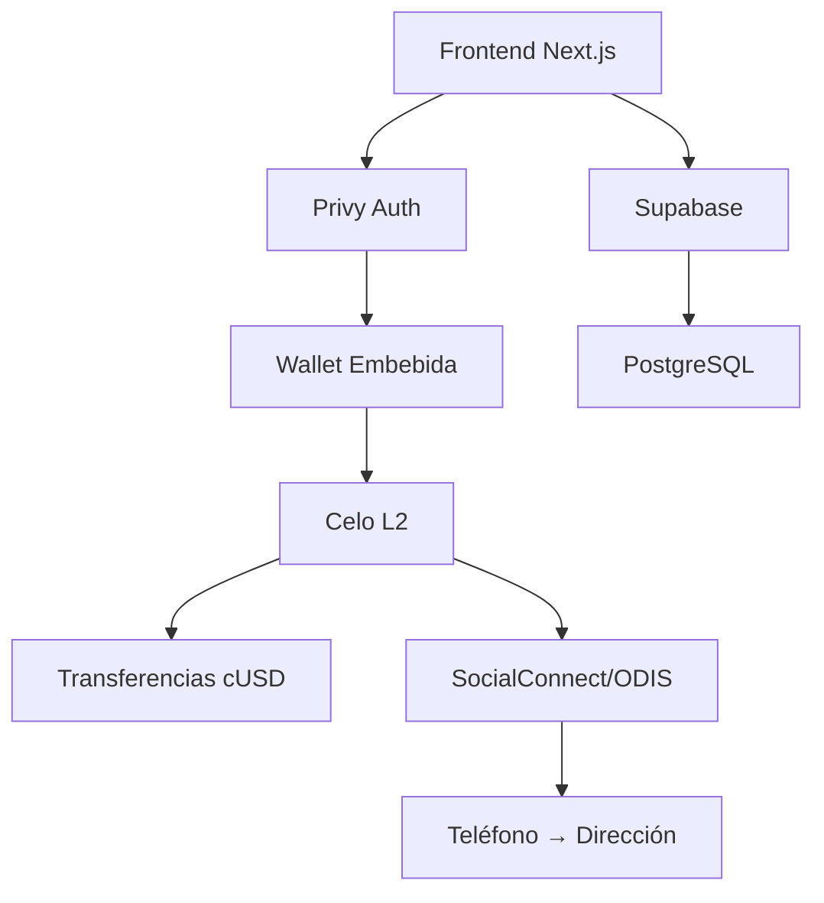

[English](./README.md) | [Español](./README.es.md) | [Português](./README.pt.md)

<div align="center">
  
  
  

# Remesas Sin Intermediarios

**$0.01 en fees • 5 segundos • Blockchain transparente**

[](https://github.com/LuisSambrano/puente-fintech-dapp/stargazers)
[](./LICENSE)
[](https://puente.vercel.app)

</div>

---

## 🌉 ¿Qué es Puente?

> _"Ese dinero es para tu familia. No para bancos."_

Puente es **el super-app financiero para la diáspora venezuelana**—empezando con remesas y expandiéndose a crowdfunding y donaciones a creadores. Construido en blockchain Celo.

### El Problema

**$3.8 mil millones** enviados anualmente a Venezuela  
**15%** perdido en fees (Western Union, MoneyGram)  
**3-5 días** para llegar  
**7.89 millones** de venezolanos en el exterior enviando dinero a casa

### Nuestra Solución

```
Western Union:  5 días  →  $15 de fee en $100  (15%)
        Puente:  5 segs  →  $0.01 de fee en $100  (<0.01%)
```

**1,500x más barato • 86,400x más rápido**

---

## 🚀 Roadmap de 3 Fases

```
FASE 1            │ FASE 2           │ FASE 3
REMESAS           │ CROWDFUNDING     │ DONACIONES
(Q1 2026)         │ (Q2 2026)        │ (Q3 2026)
──────────────────┼──────────────────┼──────────────
MVP - Activo      │ Planificado      │ Planificado
Envío/Recibo cUSD │ Médico/Emergencia│ Apoya Creadores
<$0.01 fees       │ 2% fee (vs 10%)  │ 1% fee (vs 10%)
```

### Estado Actual

| Hito                  | Estado      |
| --------------------- | ----------- |
| ✅ Landing Page       | Completado  |
| ✅ Integración Celo   | Completado  |
| ✅ Auth con Privy     | Completado  |
| 🔄 SocialConnect/ODIS | En Progreso |
| 📅 100 Txs Mainnet    | Feb 2026    |
| 📅 Demo LatamHubs     | 27 Feb      |

---

## 🏗️ Stack Tecnológico

<div align="center">


</div>

**Blockchain**: Celo L2 • Stablecoin cUSD • SocialConnect/ODIS  
**Frontend**: Next.js 15 • Framer Motion • UI Glassmorphism  
**Backend**: Supabase • Edge Functions • PostgreSQL  
**Auth**: Privy Embedded Wallets (no custodial)

### ¿Por qué Celo?

1. **Mobile-first**: Diseñado para mercados emergentes (perfecto para LATAM)
2. **Barato**: Fees de gas <$0.01 (vs Ethereum $5-50)
3. **Rápido**: Finalidad de 5 segundos
4. **SocialConnect**: Mapeo teléfono → Wallet (game changer para UX)
5. **Ecosistema LATAM**: CeLatam, Celo Mexico, Celo Colombia

---

## ⚡ Inicio Rápido

```bash
# Clonar
git clone https://github.com/LuisSambrano/puente-fintech-dapp.git
cd puente-fintech-dapp

# Instalar dependencias
pnpm install

# Configurar environment
cp apps/web/.env.example apps/web/.env.local
# Editar apps/web/.env.local con tus keys

# Ejecutar servidor de desarrollo
pnpm dev
```

Abrir [http://localhost:3000](http://localhost:3000)

---

## 🎯 Nuestro MOAT (Ventajas Competitivas)

### 1. Integración SocialConnect/ODIS

- **Mapeo Teléfono → Wallet**: No más copiar direcciones
- **Descentralizado**: Búsquedas que preservan privacidad
- **Efectos de red**: Más usuarios = más números = más útil

### 2. No Custodial + UX Simple

- **Wallets embebidas Privy**: Login con email (sin seed phrases)
- **Tú controlas fondos**: No podemos acceder a tu dinero
- **Lo mejor de ambos mundos**: Seguridad de DeFi + UX de fintech

### 3. Enfoque LATAM-First

- Contenido en Español/Portugués
- Partnerships con CeLatam, Celo Mexico
- Diseñado específicamente para diáspora venezolana

### 4. Build in Public

- Repo GitHub público
- Roadmap transparente
- Participación comunitaria en decisiones

---

## 🏗️ Arquitectura



**Flujo de Usuario:**

1. Login con email (Privy)
2. Ingresar número de teléfono del receptor
3. SocialConnect resuelve teléfono → dirección
4. Ingresar monto en USD
5. Confirmar (firmar transacción)
6. ✅ Enviado en 5 segundos

---

## 📊 Buildathon LatamHubs

**Competición**: [LatamHubs.lat](https://latamhubs.lat/)  
**Track**: MiniApps (Premio: 3,000 CELO + 300 cUSD)  
**Fechas**: 19 Ene → 27 Feb, 2026  
**Focus**: Transacciones mainnet (bonus por alta actividad)

### Nuestra Estrategia

- **Deployment temprano**: Semana 6 (principios Feb)
- **Incentivar uso**: Transferencias gratis (0% fee durante buildathon)
- **Programa de referidos**: "Envía a 3 amigos, recibe $5 cUSD"
- **Meta**: 100+ transacciones mainnet para 27 Feb

---

## 👥 Únete a la Misión

> **Construyendo para 7.89 millones de venezolanos en el exterior**

Buscamos personas apasionadas para unirse al equipo. **Talento venezolano preferido** (remoto-friendly global).

### Roles Abiertos

| Rol                           | Impacto                                        |
| ----------------------------- | ---------------------------------------------- |
| 🔧 **Auditor Smart Contract** | Asegurar nuestros contratos Solidity           |
| 🎨 **Desarrollador Frontend** | Mejorar UI Glassmorphism                       |
| 📊 **Analista de Datos**      | Construir dashboards de analytics de fees      |
| 🌍 **Community Manager**      | Crecer comunidad LATAM (Español/Portugués)     |
| 📝 **Creador de Contenido**   | Documentar nuestro journey build-in-public     |
| ⚖️ **Asesor de Compliance**   | Navegar regulaciones fintech en LatAm          |
| 🎯 **UX Researcher**          | Validar product-market fit con usuarios reales |

### Cómo Unirte

1. **Dale estrella a este repo** ⭐
2. **Abre un issue** describiendo tu interés + skills
3. **Escríbeme DM**: [@luissambrano_ux](https://x.com/luissambrano_ux) (Twitter) o [@luissambrano_ux](https://t.me/luissambrano_ux) (Telegram)

> _Pasión + mentalidad de shipping > credenciales_

---

## 📄 Licencia

[Business Source License 1.1](./LICENSE)

**TL;DR**: Visualiza y estudia el código libremente. Uso comercial requiere licencia separada.

---

<div align="center">

### 🌎 Sigue Nuestro Journey

Construyendo el futuro de las remesas para Latinoamérica.

[](https://x.com/luissambrano_ux)
[](https://t.me/luissambrano_ux)
[](https://github.com/LuisSambrano)


**Hecho con ❤️ para la diáspora venezolana**

</div>
