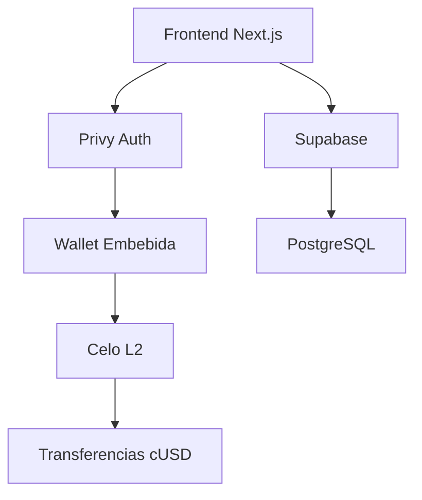

[English](./README.md) | [Español](./README.es.md) | [Português](./README.pt.md)

<div align="center">
  
  
  

# Remesas Sin Intermediarios

**$0.01 en fees • 5 segundos • Blockchain transparente**

[](https://github.com/LuisSambrano/puente-fintech-dapp/stargazers)
[](./LICENSE)
[](https://puente.vercel.app)

</div>

---

## 🌉 ¿Qué es Puente?

Puente es una plataforma de remesas no custodial para Latinoamérica construida sobre **Celo blockchain**. Estamos resolviendo el mercado de $3.8 mil millones en remesas a Venezuela—donde los servicios tradicionales cobran 15% y tardan días.

**Nuestra solución**: Transferencias instantáneas por menos de $0.01.

```
Tradicional: 5 días, $15 de comisión
     Puente: 5 segundos, $0.01 de comisión
```

---

## 🚀 Construyendo en Público

> **Estado**: Preparándonos para el Demo de [LatamHubs.lat](https://latamhubs.lat/)

Construimos en público. Cada commit, cada decisión, cada error—documentado y compartido.

| Hito                  | Estado      |
| --------------------- | ----------- |
| ✅ Landing Page MVP   | Completado  |
| ✅ Integración Celo   | Completado  |
| ✅ Auth con Privy     | Completado  |
| 🔄 SocialConnect ODIS | En Progreso |
| 📅 Demo LatamHubs     | Feb 2026    |

---

## 🛠️ Stack Tecnológico

<div align="center">


</div>

**Blockchain**: Celo L2 • Stablecoin cUSD • SocialConnect/ODIS  
**Frontend**: Next.js 15 • Framer Motion • UI Glassmorphism  
**Backend**: Supabase • Edge Functions • PostgreSQL  
**Auth**: Privy Embedded Wallets

---

## ⚡ Inicio Rápido

```bash
# Clonar
git clone https://github.com/LuisSambrano/puente-fintech-dapp.git
cd puente-fintech-dapp

# Instalar
pnpm install

# Configurar (copiar y editar)
cp apps/web/.env.example apps/web/.env.local

# Ejecutar
pnpm dev
```

Abrir [http://localhost:3000](http://localhost:3000)

---

## 🏗️ Arquitectura



---

## 👥 Únete al Equipo

> **Filosofía Vibecoding**: Creemos que el gran software se construye en estado de flujo—con alegría, no con estrés.

Buscamos personas apasionadas para unirse a nuestra misión. **Talento venezolano preferido** (remoto amigable a nivel mundial).

### 💼 Roles Fintech que Necesitamos

| Rol                               | Qué Harás                                          |
| --------------------------------- | -------------------------------------------------- |
| 🔧 **Auditor de Smart Contracts** | Revisar y asegurar nuestros contratos Solidity     |
| 🎨 **Desarrollador Frontend**     | Mejorar nuestra UI Glassmorphism con React/Next.js |
| 📊 **Analista de Datos**          | Construir dashboards de analytics y fees           |
| 🌍 **Community Manager**          | Crecer nuestra comunidad LatAm (Español/Portugués) |
| 📝 **Creador de Contenido**       | Documentar nuestro journey de build-in-public      |
| ⚖️ **Asesor de Compliance**       | Navegar regulaciones fintech en LatAm              |
| 🎯 **UX Researcher**              | Entrevistar usuarios y validar product-market fit  |
| 📱 **Product Manager**            | Priorizar features y shipear con nosotros          |

### 🎯 Cómo Unirte

1. **Dale estrella a este repo** ⭐
2. **Abre un issue** con tu interés
3. **Escríbeme**: [@luissambrano_ux](https://x.com/luissambrano_ux) (Twitter) o [@luissambrano_ux](https://t.me/luissambrano_ux) (Telegram)

> _No se requiere experiencia formal—valoramos pasión, curiosidad y mentalidad de shipping sobre credenciales._

---

## 📚 Investigación y Documentación

| Documento                                     | Propósito                            |
| --------------------------------------------- | ------------------------------------ |
| [KEY_FINDINGS.md](./research/KEY_FINDINGS.md) | Insights destilados de investigación |
| [docs/](./docs)                               | Documentación técnica                |
| [research/](./research)                       | Análisis de mercado e investigación  |

---

## 📄 Licencia

[Business Source License 1.1](./LICENSE) — Visualiza y estudia el código libremente. Uso comercial requiere licencia separada.

---

<div align="center">

### 🌎 LatamHubs 2026

Nos preparamos para [LatamHubs.lat](https://latamhubs.lat/)—construyendo el futuro de las remesas para Latinoamérica.

**Sigue nuestro journey**:  
[](https://x.com/luissambrano_ux)
[](https://t.me/luissambrano_ux)
[](https://github.com/LuisSambrano)


</div>
