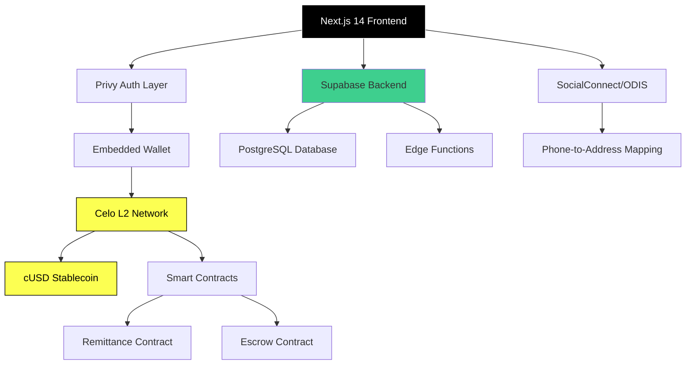

[English](./README.md) | [Español](./README.es.md)

# Puente

P2P remittance platform for Latin America built on Celo blockchain.

<!-- CTAs -->
<p align="center">
  <a href="https://github.com/LuisSambrano/puente-fintech-dapp/stargazers"></a>
  <a href="https://github.com/LuisSambrano/puente-fintech-dapp/network/members"></a>
  <a href="https://github.com/LuisSambrano/puente-fintech-dapp/issues"></a>
  <a href="https://github.com/LuisSambrano/puente-fintech-dapp/blob/main/LICENSE"></a>
</p>

## Overview

Puente is a non-custodial remittance application designed to reduce friction in cross-border payments for users in high-inflation economies. The platform leverages Celo's L2 blockchain and cUSD stablecoin to provide fast, low-cost international transfers with a mobile-first user interface.

The application addresses a critical financial need in Latin America, where traditional remittance services charge an average of 15% in fees and take days to settle. By using blockchain technology and stablecoins, Puente reduces transaction costs to under $0.01 and settles transfers in under 5 seconds.

Built as a progressive web app (PWA) optimized for MiniPay integration, the platform prioritizes accessibility for users on low-bandwidth networks while maintaining a professional, intuitive interface.

## Architecture



## Features

### Blockchain Integration

- **Celo L2 Settlement**: Sub-5 second transaction finality
- **cUSD Stablecoin**: Protection from local currency volatility
- **Smart Contracts**: Verified contracts on Celo Sepolia for secure fund routing
- **Gas Abstraction**: Transaction fees under $0.01

### Identity & Discovery

- **SocialConnect**: Phone-to-address mapping via ODIS (Oblivious Decentralized Identity Service)
- **Social Discovery**: Send funds using phone numbers instead of wallet addresses
- **Privacy-Preserving**: Decentralized identity lookup without exposing user data

### User Experience

- **Glassmorphism 2.0**: Modern translucent UI with depth and hierarchy
- **Dynamic Theming**: Light/dark mode support (Solaris/Obsidian themes)
- **Privacy Controls**: Sensitive balances obfuscated by default until authenticated
- **Mobile-First**: PWA optimized for MiniPay (Opera Mini) and low-bandwidth networks
- **Haptic Feedback**: Visual micro-interactions for action confirmation

### Security

- **Non-Custodial**: Users maintain full control of their funds
- **Privy Authentication**: Embedded wallets with passkey support
- **Audit Logging**: Real-time transaction history via Supabase
- **Smart Contract Verification**: All contracts verified on Celo block explorer

## Tech Stack


**Frontend**:

- [Next.js 14](https://nextjs.org/) - React framework with App Router
- [TypeScript](https://www.typescriptlang.org/) - Type-safe development
- [Tailwind CSS](https://tailwindcss.com/) - Utility-first styling
- [Framer Motion](https://www.framer.com/motion/) - Hardware-accelerated animations

**Blockchain**:

- [Celo](https://celo.org/) - L2 blockchain network (Sepolia testnet)
- [cUSD](https://docs.celo.org/protocol/stability) - Celo Dollar stablecoin
- [SocialConnect](https://docs.celo.org/protocol/identity) - Decentralized identity protocol
- [ODIS](https://docs.celo.org/protocol/identity/odis) - Oblivious decentralized identity service

**Infrastructure**:

- [Privy](https://privy.io/) - Embedded wallet authentication
- [Supabase](https://supabase.com/) - PostgreSQL database and Edge Functions
- [Vercel](https://vercel.com/) - Edge network deployment

## Getting Started

### Prerequisites

- Node.js 18 or higher
- pnpm package manager
- Privy account (free tier available)
- Supabase account (free tier available)
- Celo wallet with testnet cUSD (for testing)

### Installation

1. **Clone the repository**:

```bash
git clone https://github.com/LuisSambrano/puente.git
cd puente
```

2. **Install dependencies**:

```bash
pnpm install
```

3. **Configure environment variables**:

Create a `.env.local` file in the root directory:

```env
# Privy Configuration
NEXT_PUBLIC_PRIVY_APP_ID=your_privy_app_id

# Supabase Configuration
NEXT_PUBLIC_SUPABASE_URL=your_supabase_url
NEXT_PUBLIC_SUPABASE_ANON_KEY=your_supabase_anon_key

# Celo Network
NEXT_PUBLIC_CELO_NETWORK=celo-sepolia
```

Refer to `.env.example` for a complete list of required variables.

4. **Run the development server**:

```bash
pnpm dev
```

5. **Open the application**:

Navigate to [http://localhost:3000](http://localhost:3000) in your browser.

### Development Commands

```bash
pnpm dev                        # Start development server
pnpm build                      # Build for production
pnpm lint                       # Run ESLint checks
pnpm type-check                 # Run TypeScript type checking
pnpm contracts:compile          # Compile smart contracts
pnpm contracts:test             # Run contract tests
pnpm contracts:deploy           # Deploy contracts to testnet
```

## Project Structure

```
puente/
├── apps/
│   ├── web/                    # Next.js frontend application
│   │   ├── src/
│   │   │   ├── app/           # App Router pages
│   │   │   ├── components/    # React components
│   │   │   ├── lib/           # Utilities and configurations
│   │   │   └── types/         # TypeScript definitions
│   │   └── public/            # Static assets
│   └── hardhat/               # Smart contract development
│       ├── contracts/         # Solidity contracts
│       ├── scripts/           # Deployment scripts
│       └── test/              # Contract tests
├── docs/                      # Documentation
├── brandkit/                  # Brand assets
└── turbo.json                 # Turborepo configuration
```

## Smart Contracts

The platform uses verified smart contracts deployed on Celo Sepolia testnet:

- **RemittanceContract**: Handles peer-to-peer transfers with escrow functionality
- **EscrowContract**: Manages fund locking and release mechanisms

Contract addresses and verification links are available in the [docs/contracts](./docs/contracts) directory.

## Contributing

Contributions are welcome. Please follow these guidelines:

1. Fork the repository
2. Create a feature branch: `git checkout -b feature/description`
3. Make your changes with clear, atomic commits
4. Run tests: `pnpm test`
5. Push to your fork: `git push origin feature/description`
6. Submit a pull request with a detailed description

### Commit Convention

This project follows [Conventional Commits](https://www.conventionalcommits.org/):

- `feat`: New feature
- `fix`: Bug fix
- `refactor`: Code refactoring
- `style`: Code style changes
- `docs`: Documentation updates
- `test`: Test additions or modifications
- `chore`: Maintenance tasks

Example: `feat(wallet): add passkey authentication support`

## License

MIT License - See [LICENSE](LICENSE) for details.

## Links

- **Repository**: [github.com/LuisSambrano/puente](https://github.com/LuisSambrano/puente)
- **Author**: [Luis Sambrano](https://github.com/LuisSambrano)
- **Documentation**: [docs/](./docs)
- **Celo Docs**: [docs.celo.org](https://docs.celo.org)

---

**[Español](./README.es.md)** | English
