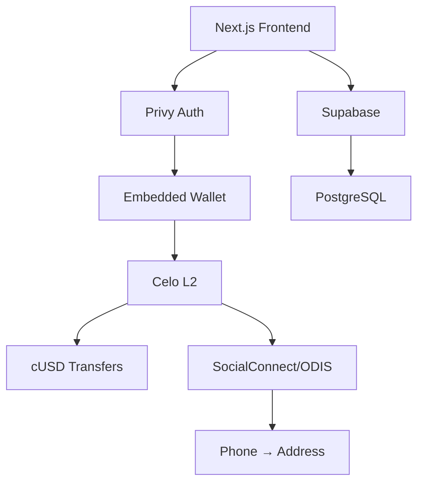

[English](./README.md) | [Español](./README.es.md) | [Português](./README.pt.md)

<div align="center">
  
  
  

# Remittances Without Intermediaries

**$0.01 fees • 5 seconds • Transparent blockchain**

[](https://github.com/LuisSambrano/puente-fintech-dapp/stargazers)
[](./LICENSE)
[](https://puente.vercel.app)

</div>

---

## 🌉 What is Puente?

> _"That money is for your family. Not for banks."_

Puente is **the financial super-app for the Venezuelan diaspora**—starting with remittances and expanding to crowdfunding and creator donations. Built on Celo blockchain.

### The Problem

**$3.8 billion** sent annually to Venezuela  
**15%** lost in fees (Western Union, MoneyGram)  
**3-5 days** to arrive  
**7.89 million** Venezuelans abroad sending money home

### Our Solution

```
Western Union:  5 days  →  $15 fee on $100  (15%)
        Puente:  5 secs  →  $0.01 fee on $100  (<0.01%)
```

**1,500x cheaper • 86,400x faster**

---

## 🚀 3-Phase Roadmap

```
PHASE 1           │ PHASE 2          │ PHASE 3
REMITTANCES       │ CROWDFUNDING     │ DONATIONS
(Q1 2026)         │ (Q2 2026)        │ (Q3 2026)
──────────────────┼──────────────────┼──────────────
MVP - Active      │ Planned          │ Planned
Send/Receive cUSD │ Medical/Emergency│ Support Creators
<$0.01 fees       │ 2% fee (vs 10%)  │ 1% fee (vs 10%)
```

### Current Status

| Milestone             | Status      |
| --------------------- | ----------- |
| ✅ Landing Page       | Complete    |
| ✅ Celo Integration   | Complete    |
| ✅ Privy Auth         | Complete    |
| 🔄 SocialConnect/ODIS | In Progress |
| 📅 100 Mainnet Txs    | Feb 2026    |
| 📅 LatamHubs Demo     | Feb 27      |

---

## 🏗️ Tech Stack

<div align="center">


</div>

**Blockchain**: Celo L2 • cUSD Stablecoin • SocialConnect/ODIS  
**Frontend**: Next.js 15 • Framer Motion • Glassmorphism UI  
**Backend**: Supabase • Edge Functions • PostgreSQL  
**Auth**: Privy Embedded Wallets (non-custodial)

### Why Celo?

1. **Mobile-first**: Built for emerging markets (perfect for LATAM)
2. **Cheap**: Gas fees <$0.01 (vs Ethereum $5-50)
3. **Fast**: 5-second finality
4. **SocialConnect**: Phone number → Wallet mapping (game changer for UX)
5. **LATAM ecosystem**: CeLatam, Celo Mexico, Celo Colombia

---

## ⚡ Quick Start

```bash
# Clone
git clone https://github.com/LuisSambrano/puente-fintech-dapp.git
cd puente-fintech-dapp

# Install dependencies
pnpm install

# Configure environment
cp apps/web/.env.example apps/web/.env.local
# Edit apps/web/.env.local with your keys

# Run development server
pnpm dev
```

Open [http://localhost:3000](http://localhost:3000)

---

## 🎯 Our MOAT (Competitive Advantages)

### 1. SocialConnect/ODIS Integration

- **Phone → Wallet mapping**: No more copying addresses
- **Decentralized**: Privacy-preserving lookups
- **Network effects**: More users = more phone numbers = more useful

### 2. Non-Custodial + Simple UX

- **Privy embedded wallets**: Email login (no seed phrases)
- **You control funds**: We can't access your money
- **Best of both worlds**: Security of DeFi + UX of fintech

### 3. LATAM-First Focus

- Content in Spanish/Portuguese
- Partnerships with CeLatam, Celo Mexico
- Designed specifically for Venezuela diaspora

### 4. Build in Public

- GitHub public repo
- Transparent roadmap
- Community involvement in decisions

---

## 🏗️ Architecture



**User Flow:**

1. Login with email (Privy)
2. Enter recipient's phone number
3. SocialConnect resolves phone → address
4. Enter amount in USD
5. Confirm (sign transaction)
6. ✅ Sent in 5 seconds

---

## 📊 LatamHubs Buildathon

**Competition**: [LatamHubs.lat](https://latamhubs.lat/)  
**Track**: MiniApps (Prize: 3,000 CELO + 300 cUSD)  
**Dates**: Jan 19 → Feb 27, 2026  
**Focus**: Mainnet transactions (bonus for high activity)

### Our Strategy

- **Early deployment**: Week 6 (early Feb)
- **Incentivize usage**: Free transfers (0% fee during buildathon)
- **Referral program**: "Send to 3 friends, get $5 cUSD"
- **Goal**: 100+ mainnet transactions by Feb 27

---

## 👥 Join the Mission

> **Building for 7.89 million Venezuelans abroad**

We're looking for passionate people to join our team. **Venezuelan talent preferred** (remote-friendly worldwide).

### Open Roles

| Role                          | Impact                                      |
| ----------------------------- | ------------------------------------------- |
| 🔧 **Smart Contract Auditor** | Secure our Solidity contracts               |
| 🎨 **Frontend Developer**     | Enhance Glassmorphism UI                    |
| 📊 **Data Analyst**           | Build fee analytics dashboards              |
| 🌍 **Community Manager**      | Grow LATAM community (Spanish/Portuguese)   |
| 📝 **Content Creator**        | Document our build-in-public journey        |
| ⚖️ **Compliance Advisor**     | Navigate LatAm fintech regulations          |
| 🎯 **UX Researcher**          | Validate product-market fit with real users |

### How to Join

1. **Star this repo** ⭐
2. **Open an issue** describing your interest + skills
3. **DM me**: [@luissambrano_ux](https://x.com/luissambrano_ux) (Twitter) or [@luissambrano_ux](https://t.me/luissambrano_ux) (Telegram)

> _Passion + shipping mindset > credentials_

---

## 📄 License

[Business Source License 1.1](./LICENSE)

**TL;DR**: View and study the code freely. Commercial use requires a separate license.

---

<div align="center">

### 🌎 Follow Our Journey

Building the future of remittances for Latin America.

[](https://x.com/luissambrano_ux)
[](https://t.me/luissambrano_ux)
[](https://github.com/LuisSambrano)


**Made with ❤️ for the Venezuelan diaspora**

## 📄 Legal & Community

[Security Policy](./SECURITY.md) • [Code of Conduct](./CODE_OF_CONDUCT.md) • [Changelog](./CHANGELOG.md)

</div>
