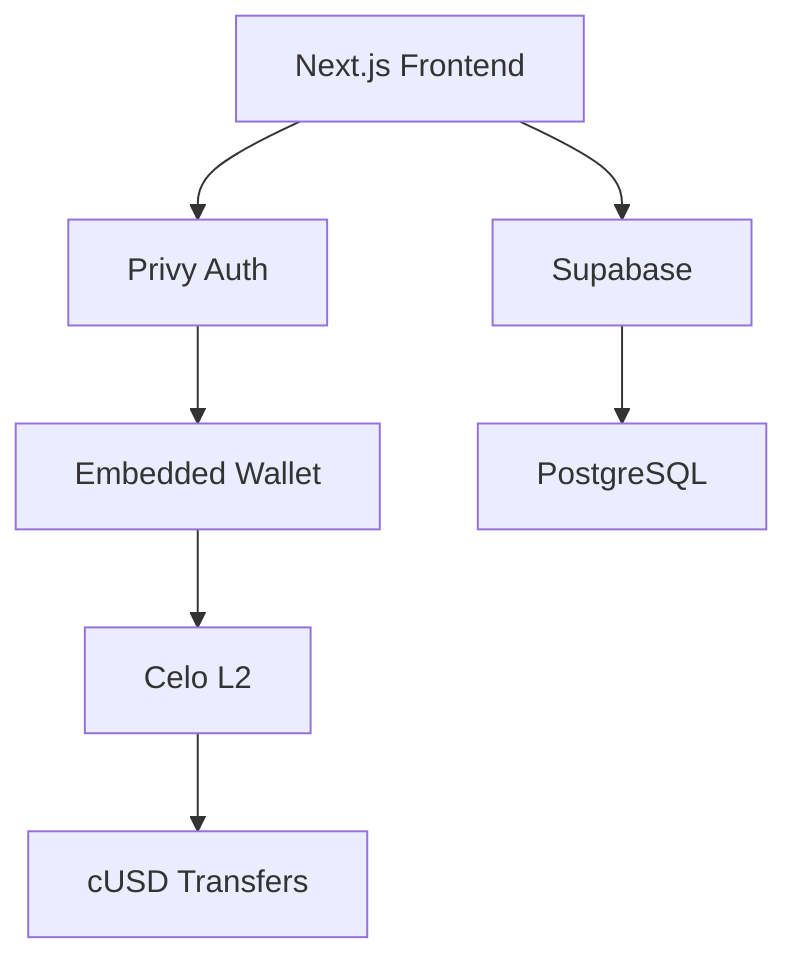

[English](./README.md) | [Español](./README.es.md) | [Português](./README.pt.md)

<div align="center">
  
  
  

# Remesas Sin Intermediarios

**$0.01 en fees • 5 segundos • Blockchain transparente**

[](https://github.com/LuisSambrano/puente-fintech-dapp/stargazers)
[](./LICENSE)
[](https://puente.vercel.app)

</div>

---

## 🌉 What is Puente?

Puente is a non-custodial remittance platform for Latin America built on **Celo blockchain**. We're solving the $3.8 billion Venezuela remittance market—where traditional services charge 15% and take days.

**Our solution**: Instant transfers for under $0.01.

```
Traditional: 5 days, $15 fee
    Puente: 5 seconds, $0.01 fee
```

---

## 🚀 Building in Public

> **Status**: Preparing for [LatamHubs.lat](https://latamhubs.lat/) Hackathon Demo

We build in public. Every commit, every decision, every mistake—documented and shared.

| Milestone             | Status      |
| --------------------- | ----------- |
| ✅ MVP Landing Page   | Complete    |
| ✅ Celo Integration   | Complete    |
| ✅ Privy Auth         | Complete    |
| 🔄 SocialConnect ODIS | In Progress |
| 📅 LatamHubs Demo     | Feb 2026    |

---

## 🛠️ Tech Stack

<div align="center">


</div>

**Blockchain**: Celo L2 • cUSD Stablecoin • SocialConnect/ODIS  
**Frontend**: Next.js 15 • Framer Motion • Glassmorphism UI  
**Backend**: Supabase • Edge Functions • PostgreSQL  
**Auth**: Privy Embedded Wallets

---

## ⚡ Quick Start

```bash
# Clone
git clone https://github.com/LuisSambrano/puente-fintech-dapp.git
cd puente-fintech-dapp

# Install
pnpm install

# Configure (copy and edit)
cp apps/web/.env.example apps/web/.env.local

# Run
pnpm dev
```

Open [http://localhost:3000](http://localhost:3000)

---

## 🏗️ Architecture



---

## 👥 Join the Team

> **Vibecoding Philosophy**: We believe great software is built in flow state—with joy, not stress.

We're looking for passionate people to join our mission. **Venezuelan talent preferred** (remote-friendly worldwide).

### 💼 Fintech Roles We Need

| Role                          | What You'll Do                                  |
| ----------------------------- | ----------------------------------------------- |
| 🔧 **Smart Contract Auditor** | Review and secure our Solidity contracts        |
| 🎨 **Frontend Developer**     | Enhance our Glassmorphism UI with React/Next.js |
| 📊 **Data Analyst**           | Build fee analytics and market dashboards       |
| 🌍 **Community Manager**      | Grow our LatAm community (Spanish/Portuguese)   |
| 📝 **Content Creator**        | Document our build-in-public journey            |
| ⚖️ **Compliance Advisor**     | Navigate LatAm fintech regulations              |
| 🎯 **UX Researcher**          | Interview users and validate product-market fit |
| 📱 **Product Manager**        | Prioritize features and ship with us            |

### 🎯 How to Join

1. **Star this repo** ⭐
2. **Open an issue** with your interest
3. **DM me**: [@luissambrano_ux](https://x.com/luissambrano_ux) (Twitter) or [@luissambrano_ux](https://t.me/luissambrano_ux) (Telegram)

> _No formal experience required—we value passion, curiosity, and shipping mindset over credentials._

---

## 📚 Research & Documentation

| Document                                      | Purpose                         |
| --------------------------------------------- | ------------------------------- |
| [KEY_FINDINGS.md](./research/KEY_FINDINGS.md) | Distilled research insights     |
| [docs/](./docs)                               | Technical documentation         |
| [research/](./research)                       | Market analysis & investigation |

---

## 📄 License

[Business Source License 1.1](./LICENSE) — View and study the code freely. Commercial use requires a separate license.

---

<div align="center">

### 🌎 LatamHubs 2026

We're preparing for [LatamHubs.lat](https://latamhubs.lat/)—building the future of remittances for Latin America.

**Follow our journey**:  
[](https://x.com/luissambrano_ux)
[](https://t.me/luissambrano_ux)
[](https://github.com/LuisSambrano)


</div>
