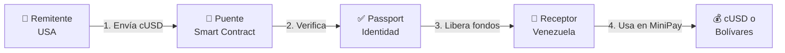

<div align="center">

# 🌉 Puente

### Remesas Peer-to-Peer para Venezuela

_Construido en público para [LatAm Hubs Buildathon 2026](https://latamhubs.lat/)_

[](https://celo.org)
[](https://latamhubs.lat)
[](docs/99-iteraciones.md)

[](https://human.tech)
[](https://v0.dev)
[](LICENSE)

[🚀 Demo en Vivo](#) • [📖 Documentación](docs/) • [🎥 Video Demo](#) • [💬 Comunidad](#)

</div>

---

## 🎯 El Problema

Enviar dinero a Venezuela es **caro**, **lento** y **excluyente**:

| Servicio Tradicional            | Puente                          |
| ------------------------------- | ------------------------------- |
| 💸 **15%** de comisión          | 💚 **<1%** de comisión          |
| ⏰ **3-5 días** de espera       | ⚡ **Minutos**                  |
| 🏦 Requiere **cuenta bancaria** | 📱 Solo necesitas **teléfono**  |
| 📄 Requiere **documentos**      | ✅ Verificación **sin papeles** |

**4 millones** de venezolanos en el exterior envían **$4B+** anuales en remesas.  
**70%** no tiene cuenta bancaria.

---

## 💡 La Solución

**Puente** es una plataforma de remesas peer-to-peer que usa blockchain para:

✨ **Reducir costos** de 15% a <1%  
⚡ **Acelerar envíos** de días a minutos  
🌍 **Eliminar intermediarios** bancarios  
🔐 **Verificar identidad** sin documentos tradicionales

### Cómo Funciona



---

## 🛠️ Stack Técnico

<div align="center">

| Categoría      | Tecnología                                                                                                                                                                      | Por Qué                            |
| -------------- | ------------------------------------------------------------------------------------------------------------------------------------------------------------------------------- | ---------------------------------- |
| **Blockchain** |                                                                                           | Móvil-first, transacciones baratas |
| **Wallet**     |                                                                                                               | Accesible desde el teléfono        |
| **Identidad**  |                                                                                                | Verificación sin documentos        |
| **Frontend**   |                                 | App Router + Fee abstraction       |
| **UI**         |                                        | Componentes móvil-first            |
| **Backend**    |   | Database + Hosting                 |
| **Contracts**  |                             | Smart contracts + Testing          |

</div>

---

## 📊 Progreso del Buildathon

> **Inicio**: 19 Enero 2026 • **Deadline**: 27 Febrero 2026 • **Días restantes**: 30

### Fase Actual: 🏗️ Setup & Planificación

```
[████████░░░░░░░░░░░░░░░░░░░░] 25% Completado

✅ Fase 0: Definición y Setup (100%)
⏳ Fase 1: Aprendizaje Básico (0%)
⬜ Fase 2: MVP Básico (0%)
⬜ Fase 3: Passport + Core Logic (0%)
⬜ Fase 4: Features Completas (0%)
⬜ Fase 5: Testing y Polish (0%)
⬜ Fase 6: Submission (0%)
```

### Hitos Completados

- [x] ✅ Proyecto definido (Remesas Venezuela)
- [x] ✅ Stack técnico decidido (Celo Composer + Viem)
- [x] ✅ Repositorio GitHub creado
- [x] ✅ Documentación inicial completa
- [x] ✅ Equipo registrado (esperando confirmación)
- [x] ✅ Misión, visión y pitch deck estructurado
- [ ] ⏳ Celo Composer ejecutado
- [ ] ⏳ Primer componente con v0
- [ ] ⏳ Passport integrado

Ver [progreso detallado](docs/buildathon-tasks.md) →

---

## 🎓 VibeCoding: Construyendo en Público

Este proyecto documenta **TODO** el proceso de construcción de forma transparente:

### 📚 Documentación Completa

| Documento                                                   | Descripción                         |
| ----------------------------------------------------------- | ----------------------------------- |
| [00-contexto.md](docs/00-contexto.md)                       | Contexto del buildathon y filosofía |
| [01-brainstorming.md](docs/01-brainstorming.md)             | Proceso de ideación                 |
| [02-decision-proyecto.md](docs/02-decision-proyecto.md)     | Por qué remesas para Venezuela      |
| [03-stack-tecnico.md](docs/03-stack-tecnico.md)             | Stack y herramientas oficiales      |
| [04-versionado.md](docs/04-versionado.md)                   | Sistema de documentación            |
| [06-recursos-referencia.md](docs/06-recursos-referencia.md) | Docs oficiales organizadas          |
| [07-mision-vision.md](docs/07-mision-vision.md)             | Identidad y pitch deck              |
| [99-iteraciones.md](docs/99-iteraciones.md)                 | **Log de cambios y aprendizajes**   |

### 🔄 Iteraciones Documentadas

> **3 iteraciones** completadas • **Última actualización**: 28 Ene 2026

1. **Iteración 1**: Decisión inicial del proyecto
2. **Iteración 2**: Descubrimiento de Celo Composer
3. **Iteración 3**: Registro y organización de recursos

[Ver todas las iteraciones →](docs/99-iteraciones.md)

---

## 🏆 Objetivos del Buildathon

### Tracks y Bounties

| Categoría                           | Premio                | Estado                |
| ----------------------------------- | --------------------- | --------------------- |
| 🎯 **MiniApps Track** (1er lugar)   | 3,000 CELO + 300 cUSD | 🎯 Objetivo principal |
| 🔐 **Human.Tech Bounty** (Passport) | $250 USDC             | ✅ Integrado          |
| 🎨 **v0 Bounty** (UI)               | $500 créditos         | ✅ Usando v0          |
| 💰 **Total Potencial**              | ~$5,000+ USD          | 🚀                    |

### Métricas de Éxito

- [ ] MVP funcional en Celo Mainnet
- [ ] 50+ transacciones reales
- [ ] 10+ usuarios verificados con Passport
- [ ] Video demo profesional (3 min)
- [ ] Documentación completa
- [ ] Proceso de aprendizaje documentado

---

## 🚀 Inicio Rápido

> **Nota**: El proyecto está en fase de setup. Instrucciones completas disponibles pronto.

```bash
# Clonar repositorio
git clone https://github.com/LuisSambrano/puente.git
cd puente

# Instalar dependencias (próximamente)
pnpm install

# Ejecutar localmente (próximamente)
pnpm dev
```

---

## 🤝 Contribuir

Este es un proyecto de buildathon construido en público. Si quieres:

- 🐛 **Reportar un bug**: [Abrir issue](../../issues)
- 💡 **Sugerir una feature**: [Abrir discussion](../../discussions)
- 📖 **Mejorar docs**: Pull requests bienvenidos
- 🧪 **Probar la app**: Únete cuando esté en testnet

---

## 👥 Equipo

**One Man Army** - LatAm Hubs Buildathon 2026

Construido con:

- ❤️ Para Venezuela
- 🧠 Google AI Pro + Gemini
- 🤖 Claude Sonnet 4.5 (Antigravity)
- 📚 Documentación exhaustiva
- 🎯 Enfoque en impacto real

---

## 📄 Licencia

MIT © 2026 One Man Army

---

## 🔗 Links

- 🌐 **Demo**: [Próximamente]
- 📊 **Karma Gap**: [Próximamente]
- 🎥 **Video Demo**: [Próximamente]
- 📧 **Contacto**: [Tu email]

---

<div align="center">

### ⭐ Si te gusta el proyecto, dale una estrella

[](../../stargazers)
[](../../network/members)

**Construido en público • Documentado en tiempo real • VibeCoding**

[LatAm Hubs Buildathon 2026](https://latamhubs.lat/) 🌎

</div>

## 🎯 Problema

Enviar dinero a Venezuela es caro, lento y requiere documentación que muchos no tienen. Las familias dependen de remesas pero los servicios tradicionales cobran comisiones altas y tardan días.

## 💡 Solución

Plataforma de remesas peer-to-peer usando:

- **Celo**: Blockchain móvil-first con transacciones baratas
- **MiniPay**: Wallet accesible desde el teléfono
- **Human.Tech Passport**: Verificación de identidad sin documentos tradicionales

## 🛠️ Stack Técnico

- **Frontend**: Next.js 14 + Viem + Wagmi
- **UI**: Shadcn/UI + TailwindCSS + v0
- **Backend**: Supabase + Vercel
- **Blockchain**: Celo Mainnet
- **Identidad**: Human.Tech Passport
- **Wallet**: MiniPay

## 🏗️ Construido Con

- [Celo Composer](https://github.com/celo-org/celo-composer) - Template oficial
- [MiniPay Template](https://github.com/celo-org/minipay-template) - Optimizado para móvil
- Inspirado en [RentPay](https://github.com/Amity808/rentpay)

## 📚 Documentación Completa

Este proyecto documenta TODO el proceso de construcción para VibeCoding:

- [`docs/00-contexto.md`](docs/00-contexto.md) - Contexto del buildathon
- [`docs/01-brainstorming.md`](docs/01-brainstorming.md) - Proceso de ideación
- [`docs/02-decision-proyecto.md`](docs/02-decision-proyecto.md) - Decisión del proyecto
- [`docs/03-stack-tecnico.md`](docs/03-stack-tecnico.md) - Stack técnico detallado
- [`docs/04-versionado.md`](docs/04-versionado.md) - Sistema de versionado
- [`docs/99-iteraciones.md`](docs/99-iteraciones.md) - Log de cambios y aprendizajes
- [`docs/buildathon-tasks.md`](docs/buildathon-tasks.md) - Checklist de tareas

## 🎓 VibeCoding

Este proyecto es parte del **LatAm Hubs Buildathon 2026**. Documentamos:

- Proceso de aprendizaje (equipo sin experiencia en Celo/React)
- Decisiones técnicas y razonamientos
- Problemas encontrados y soluciones
- Iteraciones y cambios de dirección

**Filosofía**: Transparencia total. Mostrar el proceso real de construcción, no solo el resultado.

## 🚀 Estado del Proyecto

**Fase actual**: Inicialización  
**Última actualización**: 2026-01-28

Ver [`docs/99-iteraciones.md`](docs/99-iteraciones.md) para el log completo de cambios.

## 👥 Equipo

**One Man Army** - LatAm Hubs Buildathon 2026

## 📄 Licencia

MIT

---

**Built with ❤️ for Venezuela**
