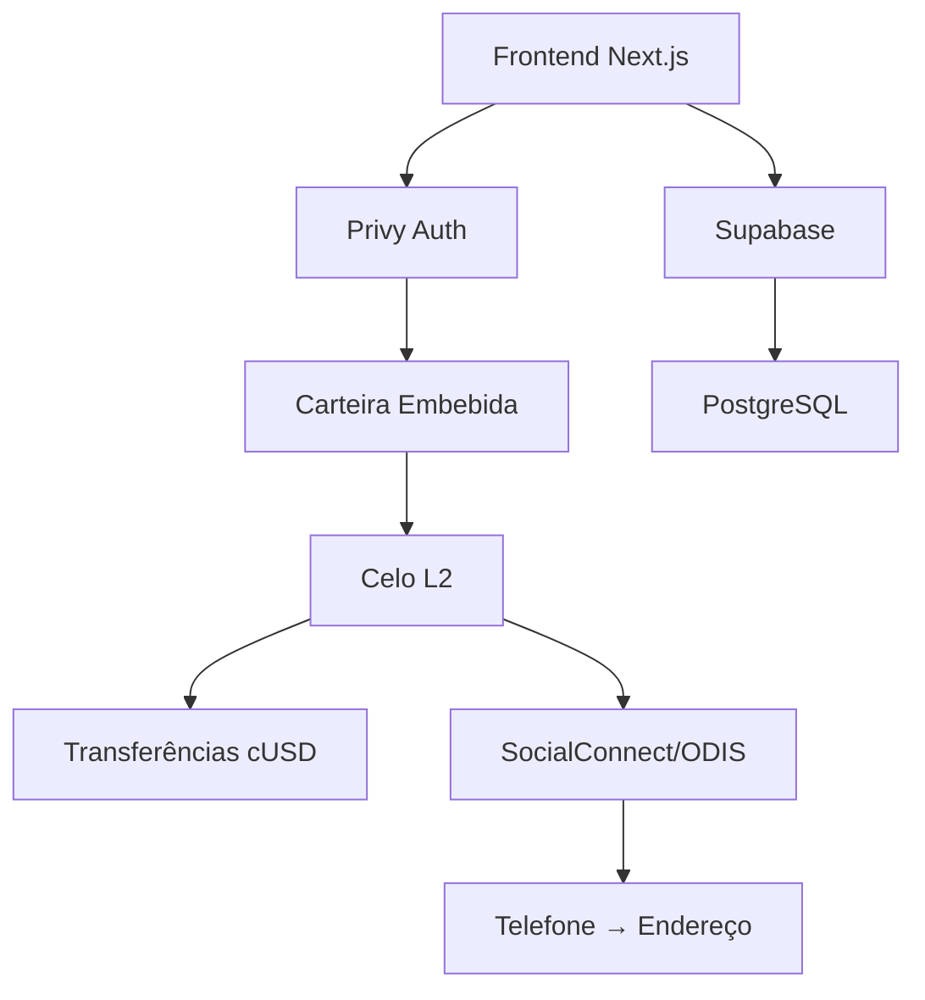

[English](./README.md) | [Español](./README.es.md) | [Português](./README.pt.md)

<div align="center">
  
  
  

# Remessas Sem Intermediários

**$0.01 em taxas • 5 segundos • Blockchain transparente**

[](https://github.com/LuisSambrano/puente-fintech-dapp/stargazers)
[](./LICENSE)
[](https://puente.vercel.app)

</div>

---

## 🌉 O que é Puente?

> _"Esse dinheiro é para sua família. Não para bancos."_

Puente é **o super-app financeiro para a diáspora venezuelana**—começando com remessas e expandindo para crowdfunding e doações a criadores. Construído na blockchain Celo.

### O Problema

**$3.8 bilhões** enviados anualmente para Venezuela  
**15%** perdido em taxas (Western Union, MoneyGram)  
**3-5 dias** para chegar  
**7.89 milhões** de venezuelanos no exterior enviando dinheiro para casa

### Nossa Solução

```
Western Union:  5 dias  →  $15 de taxa em $100  (15%)
        Puente:  5 segs  →  $0.01 de taxa em $100  (<0.01%)
```

**1,500x mais barato • 86,400x mais rápido**

---

## 🚀 Roadmap de 3 Fases

```
FASE 1            │ FASE 2           │ FASE 3
REMESSAS          │ CROWDFUNDING     │ DOAÇÕES
(Q1 2026)         │ (Q2 2026)        │ (Q3 2026)
──────────────────┼──────────────────┼──────────────
MVP - Ativo       │ Planejado        │ Planejado
Envio/Recibo cUSD │ Médico/Emergência│ Apoia Criadores
<$0.01 taxas      │ 2% taxa (vs 10%) │ 1% taxa (vs 10%)
```

### Estado Atual

| Marco                 | Status       |
| --------------------- | ------------ |
| ✅ Landing Page       | Completo     |
| ✅ Integração Celo    | Completo     |
| ✅ Auth com Privy     | Completo     |
| 🔄 SocialConnect/ODIS | Em Progresso |
| 📅 100 Txs Mainnet    | Fev 2026     |
| 📅 Demo LatamHubs     | 27 Fev       |

---

## 🏗️ Stack Tecnológico

<div align="center">


</div>

**Blockchain**: Celo L2 • Stablecoin cUSD • SocialConnect/ODIS  
**Frontend**: Next.js 15 • Framer Motion • UI Glassmorphism  
**Backend**: Supabase • Edge Functions • PostgreSQL  
**Auth**: Privy Embedded Wallets (não custodial)

### Por que Celo?

1. **Mobile-first**: Projetado para mercados emergentes (perfeito para LATAM)
2. **Barato**: Taxas de gas <$0.01 (vs Ethereum $5-50)
3. **Rápido**: Finalidade de 5 segundos
4. **SocialConnect**: Mapeamento telefone → Carteira (game changer para UX)
5. **Ecossistema LATAM**: CeLatam, Celo Mexico, Celo Colombia

---

## ⚡ Início Rápido

```bash
# Clonar
git clone https://github.com/LuisSambrano/puente-fintech-dapp.git
cd puente-fintech-dapp

# Instalar dependências
pnpm install

# Configurar environment
cp apps/web/.env.example apps/web/.env.local
# Editar apps/web/.env.local com suas chaves

# Executar servidor de desenvolvimento
pnpm dev
```

Abrir [http://localhost:3000](http://localhost:3000)

---

## 🎯 Nosso MOAT (Vantagens Competitivas)

### 1. Integração SocialConnect/ODIS

- **Mapeamento Telefone → Carteira**: Não mais copiar endereços
- **Descentralizado**: Buscas que preservam privacidade
- **Efeitos de rede**: Mais usuários = mais números = mais útil

### 2. Não Custodial + UX Simples

- **Carteiras embebidas Privy**: Login com email (sem seed phrases)
- **Você controla fundos**: Não podemos acessar seu dinheiro
- **O melhor dos dois mundos**: Segurança de DeFi + UX de fintech

### 3. Foco LATAM-First

- Conteúdo em Espanhol/Português
- Parcerias com CeLatam, Celo Mexico
- Projetado especificamente para diáspora venezuelana

### 4. Build in Public

- Repo GitHub público
- Roadmap transparente
- Participação comunitária em decisões

---

## 🏗️ Arquitetura



**Fluxo do Usuário:**

1. Login com email (Privy)
2. Inserir número de telefone do receptor
3. SocialConnect resolve telefone → endereço
4. Inserir valor em USD
5. Confirmar (assinar transação)
6. ✅ Enviado em 5 segundos

---

## 📊 Buildathon LatamHubs

**Competição**: [LatamHubs.lat](https://latamhubs.lat/)  
**Track**: MiniApps (Prêmio: 3,000 CELO + 300 cUSD)  
**Datas**: 19 Jan → 27 Fev, 2026  
**Foco**: Transações mainnet (bônus por alta atividade)

### Nossa Estratégia

- **Deployment cedo**: Semana 6 (início Fev)
- **Incentivar uso**: Transferências grátis (0% taxa durante buildathon)
- **Programa de indicações**: "Envie para 3 amigos, receba $5 cUSD"
- **Meta**: 100+ transações mainnet até 27 Fev

---

## 👥 Junte-se à Missão

> **Construindo para 7.89 milhões de venezuelanos no exterior**

Procuramos pessoas apaixonadas para se juntar à equipe. **Talento venezuelano preferido** (remoto-friendly global).

### Vagas Abertas

| Função                        | Impacto                                       |
| ----------------------------- | --------------------------------------------- |
| 🔧 **Auditor Smart Contract** | Garantir segurança dos contratos Solidity     |
| 🎨 **Desenvolvedor Frontend** | Melhorar UI Glassmorphism                     |
| 📊 **Analista de Dados**      | Construir dashboards de analytics de taxas    |
| 🌍 **Community Manager**      | Crescer comunidade LATAM (Espanhol/Português) |
| 📝 **Criador de Conteúdo**    | Documentar nossa jornada build-in-public      |
| ⚖️ **Assessor de Compliance** | Navegar regulações fintech na LatAm           |
| 🎯 **UX Researcher**          | Validar product-market fit com usuários reais |

### Como se Juntar

1. **Dê estrela neste repo** ⭐
2. **Abra um issue** descrevendo seu interesse + habilidades
3. **Me mande DM**: [@luissambrano_ux](https://x.com/luissambrano_ux) (Twitter) ou [@luissambrano_ux](https://t.me/luissambrano_ux) (Telegram)

> _Paixão + mentalidade de shipping > credenciais_

---

## 📄 Licença

[Business Source License 1.1](./LICENSE)

**TL;DR**: Visualize e estude o código livremente. Uso comercial requer licença separada.

---

<div align="center">

### 🌎 Siga Nossa Jornada

Construindo o futuro das remessas para a América Latina.

[](https://x.com/luissambrano_ux)
[](https://t.me/luissambrano_ux)
[](https://github.com/LuisSambrano)


**Feito com ❤️ para a diáspora venezuelana**

</div>
