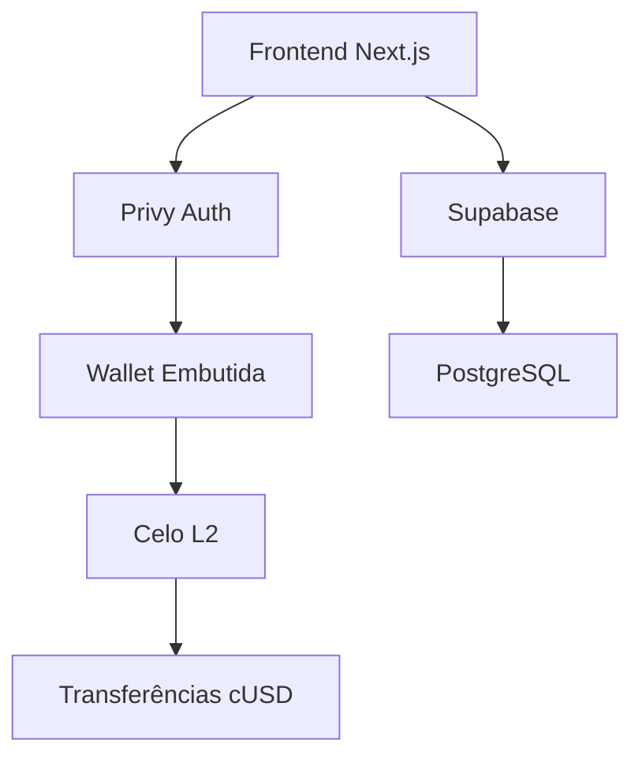

[English](./README.md) | [Español](./README.es.md) | [Português](./README.pt.md)

<div align="center">
  
  
  

# Remessas Sem Intermediários

**$0.01 em taxas • 5 segundos • Blockchain transparente**

[](https://github.com/LuisSambrano/puente-fintech-dapp/stargazers)
[](./LICENSE)
[](https://puente.vercel.app)

</div>

---

## 🌉 O que é Puente?

Puente é uma plataforma de remessas não custodial para a América Latina construída na **blockchain Celo**. Estamos resolvendo o mercado de $3.8 bilhões em remessas para a Venezuela—onde serviços tradicionais cobram 15% e demoram dias.

**Nossa solução**: Transferências instantâneas por menos de $0.01.

```
Tradicional: 5 dias, $15 de taxa
     Puente: 5 segundos, $0.01 de taxa
```

---

## 🚀 Construindo em Público

> **Status**: Preparando para o Demo do [LatamHubs.lat](https://latamhubs.lat/)

Construímos em público. Cada commit, cada decisão, cada erro—documentado e compartilhado.

| Marco                 | Status       |
| --------------------- | ------------ |
| ✅ Landing Page MVP   | Completo     |
| ✅ Integração Celo    | Completo     |
| ✅ Auth com Privy     | Completo     |
| 🔄 SocialConnect ODIS | Em Progresso |
| 📅 Demo LatamHubs     | Fev 2026     |

---

## 🛠️ Stack Tecnológico

<div align="center">


</div>

**Blockchain**: Celo L2 • Stablecoin cUSD • SocialConnect/ODIS  
**Frontend**: Next.js 15 • Framer Motion • UI Glassmorphism  
**Backend**: Supabase • Edge Functions • PostgreSQL  
**Auth**: Privy Embedded Wallets

---

## ⚡ Início Rápido

```bash
# Clonar
git clone https://github.com/LuisSambrano/puente-fintech-dapp.git
cd puente-fintech-dapp

# Instalar
pnpm install

# Configurar (copiar e editar)
cp apps/web/.env.example apps/web/.env.local

# Executar
pnpm dev
```

Abrir [http://localhost:3000](http://localhost:3000)

---

## 🏗️ Arquitetura



---

## 👥 Junte-se ao Time

> **Filosofia Vibecoding**: Acreditamos que o grande software é construído em estado de flow—com alegria, não com estresse.

Buscamos pessoas apaixonadas para se juntar à nossa missão. **Talento venezuelano preferido** (remoto amigável mundialmente).

### 💼 Cargos Fintech que Precisamos

| Cargo                             | O que Você Fará                                     |
| --------------------------------- | --------------------------------------------------- |
| 🔧 **Auditor de Smart Contracts** | Revisar e garantir nossos contratos Solidity        |
| 🎨 **Desenvolvedor Frontend**     | Melhorar nossa UI Glassmorphism com React/Next.js   |
| 📊 **Analista de Dados**          | Construir dashboards de analytics e taxas           |
| 🌍 **Community Manager**          | Crescer nossa comunidade LatAm (Espanhol/Português) |
| 📝 **Criador de Conteúdo**        | Documentar nossa jornada de build-in-public         |
| ⚖️ **Consultor de Compliance**    | Navegar regulações fintech na LatAm                 |
| 🎯 **UX Researcher**              | Entrevistar usuários e validar product-market fit   |
| 📱 **Product Manager**            | Priorizar features e shipear conosco                |

### 🎯 Como Entrar

1. **Dê uma estrela neste repo** ⭐
2. **Abra uma issue** com seu interesse
3. **Me manda DM**: [@luissambrano_ux](https://x.com/luissambrano_ux) (Twitter) ou [@luissambrano_ux](https://t.me/luissambrano_ux) (Telegram)

> _Experiência formal não é requisito—valorizamos paixão, curiosidade e mentalidade de shipping sobre credenciais._

---

## 📚 Pesquisa e Documentação

| Documento                                     | Propósito                         |
| --------------------------------------------- | --------------------------------- |
| [KEY_FINDINGS.md](./research/KEY_FINDINGS.md) | Insights destilados da pesquisa   |
| [docs/](./docs)                               | Documentação técnica              |
| [research/](./research)                       | Análise de mercado e investigação |

---

## 📄 Licença

[Business Source License 1.1](./LICENSE) — Visualize e estude o código livremente. Uso comercial requer licença separada.

---

<div align="center">

### 🌎 LatamHubs 2026

Estamos nos preparando para o [LatamHubs.lat](https://latamhubs.lat/)—construindo o futuro das remessas para a América Latina.

**Siga nossa jornada**:  
[](https://x.com/luissambrano_ux)
[](https://t.me/luissambrano_ux)
[](https://github.com/LuisSambrano)


</div>
