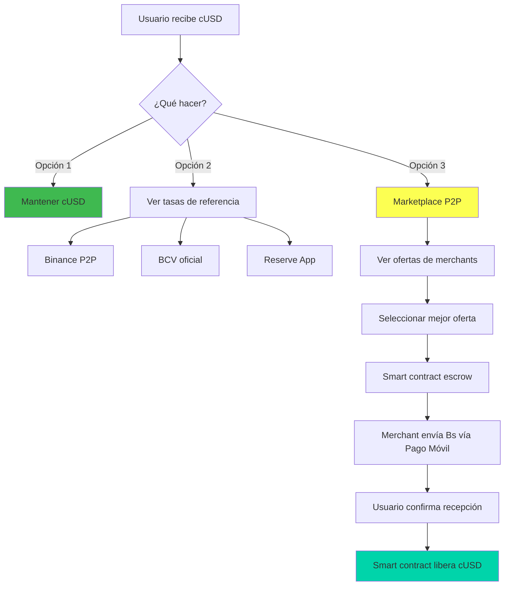

# Integración Pago Móvil: Análisis Técnico y Estratégico

> **Documento de Brainstorming Profesional**  
> **Fecha**: 28 Enero 2026  
> **Objetivo**: Evaluar la viabilidad de integrar Pago Móvil como "off-ramp" para convertir crypto → bolívares

---

## 🎯 Problema Identificado

**Insight crítico del usuario**:

> "La salida del dinero recibido en Venezuela es clave. Una vez recibida la remesa, lo más fácil es pagar o enviar Pago Móvil. Esto sería un **game changer** frente a la competencia."

**Flujo actual** (sin Pago Móvil):

```
Remitente (USA) → cUSD → Receptor (VE) → ¿Qué hace con cUSD?
```

**Problema**: El receptor venezolano necesita **bolívares** para:

- Pagar servicios (luz, agua, internet)
- Comprar en comercios locales que no aceptan crypto
- Enviar dinero a familiares vía Pago Móvil

**Flujo propuesto** (con Pago Móvil):

```
Remitente (USA) → cUSD → Receptor (VE) → Opción A: Mantener cUSD
                                        → Opción B: Convertir a Bs + Pago Móvil
```

---

## 📊 Análisis del Mercado Actual

### Cómo Funciona Pago Móvil en Venezuela

**Sistema oficial**:

- **Operador**: Sistema interbancario venezolano
- **Requisitos**: Número de teléfono + Cédula + Banco afiliado
- **Velocidad**: Instantáneo (segundos)
- **Costo**: Gratis entre usuarios
- **Límites**: Varían por banco (típicamente $50-500/día)

**Uso real**:

- **Adopción**: ~80% de transacciones digitales en Venezuela
- **Casos de uso**: Pagos P2P, comercios, servicios, remesas locales

### Competidores que YA lo Hacen

| Plataforma        | Cómo Funciona                                   | Limitaciones                                                                                                  |
| ----------------- | ----------------------------------------------- | ------------------------------------------------------------------------------------------------------------- |
| **Binance P2P**   | Merchants compran crypto y pagan vía Pago Móvil | • Riesgo de scams<br>• Tasa variable (spread 2-5%)<br>• Requiere confiar en merchant<br>• Bloqueado por CANTV |
| **Reserve App**   | Integración directa RSV → Bs → Pago Móvil       | • Solo funciona con RSV<br>• Liquidez limitada<br>• No es P2P puro                                            |
| **El Dorado P2P** | Similar a Binance, merchants + escrow           | • Menor liquidez que Binance<br>• Spread 3-6%                                                                 |

**Conclusión**: **SÍ existe demanda real** y competidores ya lo están haciendo.

---

## 🛠️ Modelos de Implementación

### Modelo 1: Marketplace P2P Interno (Más Simple)

**Cómo funciona**:

1. Usuario recibe cUSD en Puente
2. Usuario solicita conversión a Bs
3. Puente muestra ofertas de "Merchants" (usuarios que compran cUSD)
4. Usuario acepta oferta
5. Smart contract hace escrow de cUSD
6. Merchant envía Bs vía Pago Móvil
7. Usuario confirma recepción
8. Smart contract libera cUSD al merchant

**Ventajas**:

- ✅ No requiere licencias bancarias
- ✅ Descentralizado (P2P real)
- ✅ Puente solo cobra fee por matching
- ✅ Escalable (más merchants = más liquidez)

**Desventajas**:

- ❌ Requiere liquidez inicial (merchants)
- ❌ Riesgo de scams (mitigable con reputación)
- ❌ Spread variable (depende de oferta/demanda)

**Stack técnico**:

```solidity
// Smart Contract: P2P Marketplace
contract PagoMovilMarketplace {
    struct Offer {
        address merchant;
        uint256 rate; // Bs por cUSD
        uint256 minAmount;
        uint256 maxAmount;
        uint256 reputation;
    }

    struct Trade {
        address buyer;
        address merchant;
        uint256 amount;
        uint256 rate;
        bool confirmed;
    }

    mapping(uint256 => Offer) public offers;
    mapping(uint256 => Trade) public trades;

    function createOffer(uint256 rate, uint256 min, uint256 max) external;
    function acceptOffer(uint256 offerId, uint256 amount) external;
    function confirmPayment(uint256 tradeId) external;
    function disputeTrade(uint256 tradeId) external;
}
```

---

### Modelo 2: Liquidity Pool Automatizado (Más Complejo)

**Cómo funciona**:

1. Puente mantiene un pool de liquidez (cUSD ↔ Bs)
2. Usuarios depositan cUSD o Bs en el pool
3. Conversiones automáticas usando AMM (Automated Market Maker)
4. Puente envía Bs vía Pago Móvil automáticamente

**Ventajas**:

- ✅ Conversión instantánea
- ✅ Sin necesidad de esperar merchants
- ✅ Tasa predecible (algoritmo AMM)

**Desventajas**:

- ❌ Requiere capital inicial significativo
- ❌ Riesgo de impermanent loss
- ❌ Complejidad técnica alta
- ❌ **Problema crítico**: ¿Cómo automatizar Pago Móvil?

**Blocker técnico**:

> Pago Móvil **NO tiene API pública**. Cada banco tiene su propia app/web. No hay forma de automatizar envíos sin:
>
> - Acceso a API bancaria (requiere licencia)
> - Bot que controle app bancaria (frágil, ilegal)
> - Partnership con banco (complejo, lento)

---

### Modelo 3: Híbrido (Recomendado para MVP)

**Fase 1 (Buildathon - Feb 2026)**:

- **Solo mostrar tasas de referencia** (Binance P2P, BCV)
- **Educar al usuario**: "Puedes vender tu cUSD en Binance P2P"
- **Link directo** a Binance P2P con monto pre-llenado
- **No implementar conversión** (solo info)

**Fase 2 (Post-Buildathon - Mar-Abr 2026)**:

- **Marketplace P2P interno** (Modelo 1)
- **Merchants verificados** con Passport
- **Sistema de reputación** (estrellas, reviews)
- **Escrow automático** vía smart contract

**Fase 3 (Escalamiento - May+ 2026)**:

- **Partnership con exchange local** (Reserve, El Dorado)
- **API integration** para tasas en tiempo real
- **Posible licencia** si volumen justifica

---

## ⚖️ Implicaciones Legales y Regulatorias

### SUNACRIP (Regulador Crypto en Venezuela)

**Estado actual** (2026):

- **Inactivo desde Marzo 2023** (escándalo de corrupción)
- **Vacío regulatorio** hasta al menos Marzo 2024
- **Reorganización en proceso**

**Regulaciones previas** (pre-2023):

- Límites mensuales para remesas crypto
- Fees obligatorios para transacciones
- Plataforma "Patria" para remesas individuales
- Requisitos AML/KYC

**Riesgo actual**:

- ⚠️ **Medio-Alto**: Regulación puede cambiar sin aviso
- ⚠️ **Sanciones USA**: Venezuela bajo sanciones, intensificación esperada en 2026
- ⚠️ **Compliance**: Necesario implementar AML/KYC robusto

### Clasificación de Actividad

| Actividad                              | Requiere Licencia | Riesgo Legal |
| -------------------------------------- | ----------------- | ------------ |
| **P2P Marketplace** (solo matching)    | ❌ No             | 🟡 Medio     |
| **Custody de fondos** (escrow)         | ⚠️ Depende        | 🟡 Medio     |
| **Conversión directa** (como exchange) | ✅ Sí             | 🔴 Alto      |
| **Partnership con exchange**           | ❌ No             | 🟢 Bajo      |

**Recomendación legal**:

> Para MVP (Buildathon), **NO implementar conversión directa**. Solo marketplace P2P donde Puente actúa como intermediario, no como exchange.

---

## 💰 Análisis Económico

### Estructura de Costos

**Modelo P2P Marketplace**:

| Concepto       | Costo   | Quién Paga                  |
| -------------- | ------- | --------------------------- |
| **Spread**     | 2-5%    | Usuario (implícito en tasa) |
| **Fee Puente** | 0.5-1%  | Usuario (explícito)         |
| **Gas Celo**   | ~$0.001 | Usuario                     |
| **Pago Móvil** | Gratis  | N/A                         |

**Ejemplo**:

- Usuario recibe: $100 cUSD
- Quiere convertir a Bs
- Tasa BCV: 360 Bs/$
- Tasa merchant: 350 Bs/$ (spread 2.8%)
- Fee Puente: 0.5%
- **Usuario recibe**: 350 × 100 × 0.995 = **34,825 Bs**
- **Merchant recibe**: 100 cUSD - 0.5 cUSD (fee) = **99.5 cUSD**
- **Puente recibe**: 0.5 cUSD = **$0.50**

### Comparación con Competencia

| Servicio               | Tasa Total | Velocidad   | Requiere Docs           |
| ---------------------- | ---------- | ----------- | ----------------------- |
| **Binance P2P**        | 2-5%       | 5-30 min    | ❌ No                   |
| **Reserve App**        | 1-3%       | Instantáneo | ✅ Sí (después de 3 tx) |
| **Western Union**      | 10-15%     | 2-3 días    | ✅ Sí                   |
| **Puente (propuesto)** | 3-6%       | 10-20 min   | ❌ No (Passport)        |

**Ventaja competitiva**:

- ✅ Sin documentos (Passport en lugar de cédula)
- ✅ Más rápido que Western Union
- ✅ Más seguro que Binance P2P (escrow + reputación)
- ❌ Más caro que Reserve (pero Reserve requiere docs)

---

## 🔧 Implementación Técnica

### Arquitectura Propuesta (Modelo Híbrido)



### Stack Técnico Detallado

**Smart Contracts** (Solidity):

```solidity
// 1. Marketplace Contract
contract PagoMovilMarketplace {
    // Gestión de ofertas
    // Sistema de reputación
    // Escrow de cUSD
    // Dispute resolution
}

// 2. Reputation Contract
contract ReputationSystem {
    // Puntaje de merchants
    // Reviews de usuarios
    // Penalizaciones por disputes
}

// 3. Oracle Contract (opcional)
contract PriceOracle {
    // Tasa BCV
    // Tasa Binance P2P
    // Tasa promedio del marketplace
}
```

**Frontend** (Next.js):

```typescript
// Componentes clave
- OfferList: Muestra ofertas disponibles
- TradeModal: Inicia trade con merchant
- ConfirmationFlow: Confirma recepción de Bs
- DisputePanel: Maneja disputes
- MerchantDashboard: Panel para merchants
```

**Backend** (Supabase):

```sql
-- Tablas necesarias
CREATE TABLE merchants (
    id UUID PRIMARY KEY,
    wallet_address TEXT,
    passport_score INTEGER,
    reputation_score DECIMAL,
    total_trades INTEGER,
    successful_trades INTEGER
);

CREATE TABLE offers (
    id UUID PRIMARY KEY,
    merchant_id UUID REFERENCES merchants(id),
    rate DECIMAL, -- Bs por cUSD
    min_amount DECIMAL,
    max_amount DECIMAL,
    active BOOLEAN
);

CREATE TABLE trades (
    id UUID PRIMARY KEY,
    offer_id UUID REFERENCES offers(id),
    buyer_wallet TEXT,
    merchant_wallet TEXT,
    amount DECIMAL,
    rate DECIMAL,
    status TEXT, -- pending, confirmed, disputed, completed
    created_at TIMESTAMP
);
```

### Flujo de Usuario (UX)

**Paso 1: Recepción de remesa**

```
✅ Has recibido 100 cUSD ($100)

¿Qué quieres hacer?
[ ] Mantener en cUSD (recomendado para ahorrar)
[ ] Convertir a bolívares (para gastar localmente)
```

**Paso 2: Ver opciones de conversión**

```
💱 Tasas de conversión disponibles:

📊 Referencia:
- BCV oficial: 360 Bs/$
- Binance P2P: 350-355 Bs/$

🏪 Merchants en Puente:
┌─────────────────────────────────────┐
│ ⭐⭐⭐⭐⭐ @MerchantPro (245 trades) │
│ 352 Bs/$ • Min: $10 • Max: $500    │
│ [Vender cUSD] →                     │
└─────────────────────────────────────┘

┌─────────────────────────────────────┐
│ ⭐⭐⭐⭐ @CryptoVzla (89 trades)     │
│ 351 Bs/$ • Min: $20 • Max: $300    │
│ [Vender cUSD] →                     │
└─────────────────────────────────────┘
```

**Paso 3: Confirmar trade**

```
📝 Resumen del trade:

Vendes: 100 cUSD
Recibes: ~35,024 Bs (352 Bs/$ - 0.5% fee)
Merchant: @MerchantPro ⭐⭐⭐⭐⭐

⚠️ Instrucciones:
1. Confirma el trade
2. Espera Pago Móvil del merchant
3. Verifica el monto en tu banco
4. Confirma recepción en Puente

[Confirmar Trade] [Cancelar]
```

**Paso 4: Esperar Pago Móvil**

```
⏳ Esperando pago del merchant...

El merchant debe enviarte:
💰 35,024 Bs vía Pago Móvil

A tu cuenta:
📱 0412-XXX-XXXX (Banesco)

Tiempo límite: 15 minutos
[¿No recibiste el pago?] → Abrir dispute
```

**Paso 5: Confirmar recepción**

```
✅ ¿Recibiste el Pago Móvil?

Verifica en tu app bancaria:
- Monto: 35,024 Bs
- Remitente: [Nombre del merchant]

[Sí, recibí el pago] → Libera cUSD
[No, abrir dispute] → Soporte
```

---

## 🚨 Riesgos y Mitigaciones

### Riesgos Técnicos

| Riesgo                  | Probabilidad | Impacto  | Mitigación                                                                                                 |
| ----------------------- | ------------ | -------- | ---------------------------------------------------------------------------------------------------------- |
| **Scams de merchants**  | 🟡 Media     | 🔴 Alto  | • Sistema de reputación<br>• Escrow obligatorio<br>• Passport verification<br>• Límites por merchant nuevo |
| **Falta de liquidez**   | 🟡 Media     | 🟡 Medio | • Incentivos para merchants<br>• Partnership con exchanges<br>• Marketing a traders                        |
| **Disputes frecuentes** | 🟢 Baja      | 🟡 Medio | • Proceso claro de dispute<br>• Evidencia on-chain<br>• Penalizaciones                                     |
| **Smart contract bugs** | 🟢 Baja      | 🔴 Alto  | • Auditoría de contratos<br>• Testing exhaustivo<br>• Bug bounty                                           |

### Riesgos Regulatorios

| Riesgo                                | Probabilidad | Impacto  | Mitigación                                                                           |
| ------------------------------------- | ------------ | -------- | ------------------------------------------------------------------------------------ |
| **SUNACRIP reactiva**                 | 🟡 Media     | 🟡 Medio | • Monitorear regulación<br>• Compliance proactivo<br>• Legal counsel                 |
| **Sanciones USA**                     | 🟡 Media     | 🔴 Alto  | • KYC/AML robusto<br>• Bloquear IPs sancionadas<br>• Documentar compliance           |
| **Bancos bloquean Pago Móvil crypto** | 🟢 Baja      | 🟡 Medio | • Diversificar merchants<br>• Educación a usuarios<br>• Alternativas (Zelle, PayPal) |

### Riesgos de Negocio

| Riesgo                             | Probabilidad | Impacto  | Mitigación                                                            |
| ---------------------------------- | ------------ | -------- | --------------------------------------------------------------------- |
| **Competencia (Binance, Reserve)** | 🔴 Alta      | 🟡 Medio | • Diferenciación (Passport)<br>• UX superior<br>• Fees competitivos   |
| **Volatilidad de tasas**           | 🔴 Alta      | 🟢 Bajo  | • Tasas en tiempo real<br>• Educación a usuarios                      |
| **Adopción lenta**                 | 🟡 Media     | 🟡 Medio | • Marketing agresivo<br>• Incentivos early adopters<br>• Partnerships |

---

## 📋 Roadmap de Implementación

### Fase 0: Research & Validation (Ahora - Feb 10)

- [x] Investigar mercado de Pago Móvil
- [x] Analizar competidores (Binance P2P, Reserve)
- [x] Definir modelos de implementación
- [ ] Validar con early testers (5-10 personas)
- [ ] Documentar hallazgos

### Fase 1: MVP Informativo (Feb 11-27 - Buildathon)

- [ ] **NO implementar conversión** (solo info)
- [ ] Mostrar tasas de referencia (BCV, Binance P2P)
- [ ] Link a Binance P2P con monto pre-llenado
- [ ] Educar usuarios sobre opciones
- [ ] **Objetivo**: Validar demanda sin complejidad técnica

### Fase 2: Marketplace P2P (Mar-Abr 2026)

- [ ] Smart contracts (escrow, reputación)
- [ ] Frontend (ofertas, trades, confirmaciones)
- [ ] Backend (merchants, trades, disputes)
- [ ] Sistema de reputación
- [ ] Testing con 10-20 merchants
- [ ] **Objetivo**: Lanzar marketplace funcional

### Fase 3: Escalamiento (May+ 2026)

- [ ] Partnership con exchange local
- [ ] API integration (tasas en tiempo real)
- [ ] Optimización de liquidez
- [ ] Marketing agresivo
- [ ] **Objetivo**: 100+ trades/día

---

## 💡 Recomendaciones Finales

### Para el Buildathon (Feb 2026)

**✅ SÍ hacer**:

1. **Documentar esta investigación** en el README
2. **Mostrar tasas de referencia** (BCV, Binance P2P)
3. **Educar usuarios** sobre opciones de conversión
4. **Validar demanda** con early testers
5. **Mencionar en pitch**: "Roadmap incluye Pago Móvil integration"

**❌ NO hacer**:

1. **NO implementar conversión** (muy complejo para 30 días)
2. **NO prometer funcionalidad** que no tenemos
3. **NO subestimar complejidad legal**

### Para Post-Buildathon

**Prioridad 1** (si ganamos funding):

- Implementar Marketplace P2P (Modelo 1)
- Contratar legal counsel para compliance
- Reclutar 20-30 merchants iniciales

**Prioridad 2** (si no ganamos):

- Partnership con Reserve o El Dorado
- Integración vía API (más simple que marketplace propio)
- Enfocarnos en UX de remesas, no conversión

---

## 📚 Fuentes y Referencias

**Pago Móvil**:

- [Ria Money Transfer - Pago Móvil](https://www.riamoneytransfer.com)
- [BNC Dinero Express](https://eldiario.com)
- [Zoom Remesas](https://zoom.red)

**Binance P2P**:

- [Binance P2P Venezuela](https://www.binance.com/es-LA/support/faq/c-98)
- [Binance Merchant Program](https://www.binance.com/en/support/faq/merchant)

**Reserve App**:

- [Reserve Venezuela](https://ultimasnoticias.com.ve)

**Regulación**:

- [SUNACRIP Status](https://lightspark.com/crypto-guides/venezuela)
- [Venezuela Crypto Regulations](https://elliptic.co)

**Tasas**:

- [USDT/VES Exchange Rate](https://www.coingecko.com)
- [BCV Official Rate](https://www.bcv.org.ve)

---

## 🎯 Conclusión

**La integración de Pago Móvil es un game changer**, pero:

1. **Para el Buildathon**: Solo documentar y mostrar tasas de referencia
2. **Para Post-Buildathon**: Implementar Marketplace P2P si hay funding
3. **Diferenciación clave**: Passport + UX superior + Reputación robusta

**Próximo paso**: Validar con early testers si realmente usarían esta funcionalidad.
