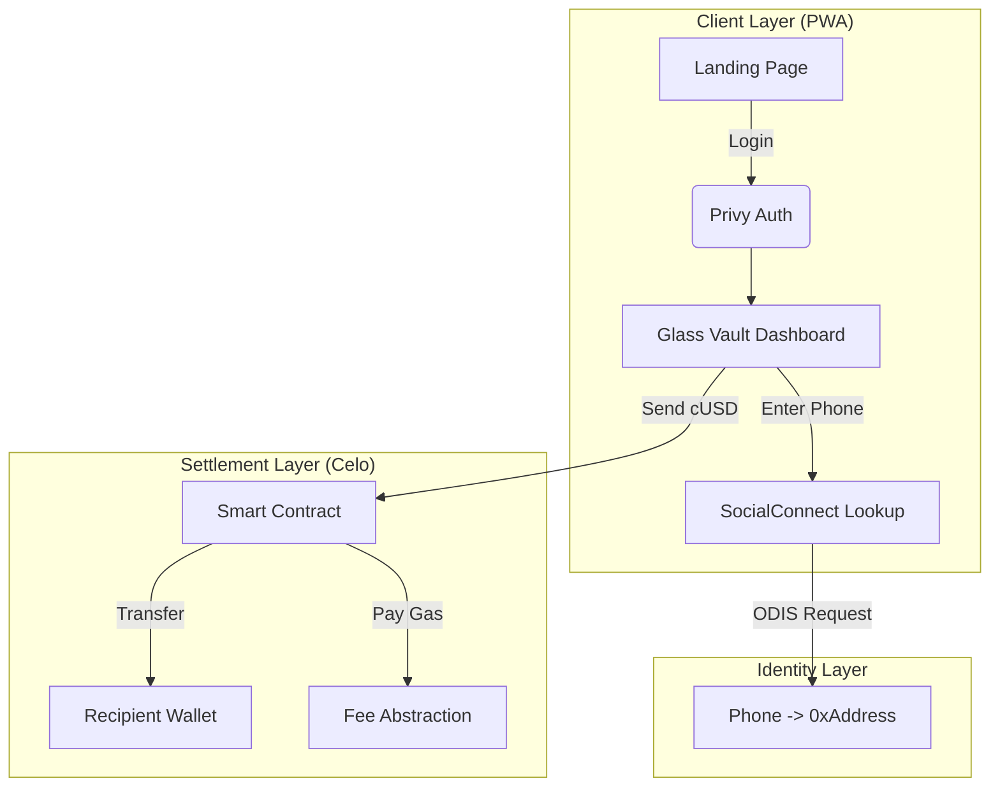

# 🏛️ Blueprint: Puente Buildathon Master Plan

> **Strategic Objective**: Win the "MiniApps" Track by delivering a **Mobile-First**, **Stablecoin-Native** remittance tool that feels like a "Glass Vault" (Apple Quality).

## 🧱 The Stack (Verified)

- **Frontend**: Next.js 14 + Tailwind (Bridge Brand) + Framer Motion.
- **Identity**: SocialConnect (ODIS) + Privy (Auth).
- **Settlement**: Celo Sepolia (L2) + cUSD (Stable) + Fee Abstraction.
- **Data**: Supabase (Postgres) for User Profiles.

## 📐 Architecture Diagram (End-to-End)

## ⚠️ Risk Assessment & Mitigation

| Risk                     | Impact      | Mitigation                                                                   |
| :----------------------- | :---------- | :--------------------------------------------------------------------------- |
| **PWA Not Installable**  | 🔴 Critical | **Action**: Install `next-pwa`, configure `manifest.json` immediately.       |
| **Visual Inconsistency** | 🟠 High     | **Action**: Refactor `UserDashboard` to match `LandingHero` (Glassmorphism). |
| **ODIS Failure**         | 🟡 Medium   | **Fallback**: Allow manual address entry (already implemented).              |

---

## 🚀 Execution Phases (The Final Sprint)

### ✅ Phase 1: Foundation (Completed)

- [x] Next.js Setup & Privy Auth.
- [x] Supabase User Sync.
- [x] Landing Page "Apple Vibe".

### ✅ Phase 2: Logic (Completed)

- [x] cUSD Integration (Stablecoin Pivot).
- [x] SocialConnect Lookup (Lab Mode).
- [x] Fee Abstraction Logic.

### 🚧 Phase 3: The "Glass Vault" Refactor (NEXT STEP)

> **Goal**: Replace the "Legacy" Dashboard with the "Apple Vibe" design.

1.  **Layout**: Apply `NetworkGuard` and `GlassContainer`.
2.  **Components**:
    - **BalanceHero**: Big, centered cUSD balance.
    - **ActionRing**: Circular Glass Buttons (Send, Receive).
    - **TransactionList**: Glass Cards with "Spring" animations.
3.  **Visuals**: Remove all `bg-white`, use `glass-deep-frost`.

### 🚧 Phase 4: Mobile Edge (PWA)

> **Goal**: Make it installable on Android/iOS.

1.  **Config**: Install `next-pwa`.
2.  **Manifest**: Add Icons (512x512) and `theme_color`.
3.  **Service Worker**: Ensure offline fallback.

---

## 📊 Success Metrics (Buildathon KPI)

1.  **Time to First Tx**: < 30 seconds (Login -> Send).
2.  **Visual Quality**: "Wow" Factor (Glassmorphism).
3.  **Real Value**: Sending cUSD (Encourages usage).
